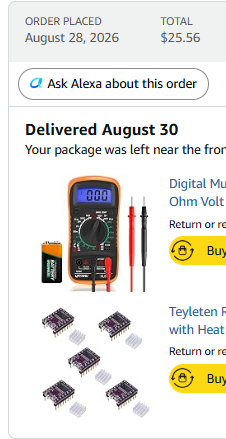
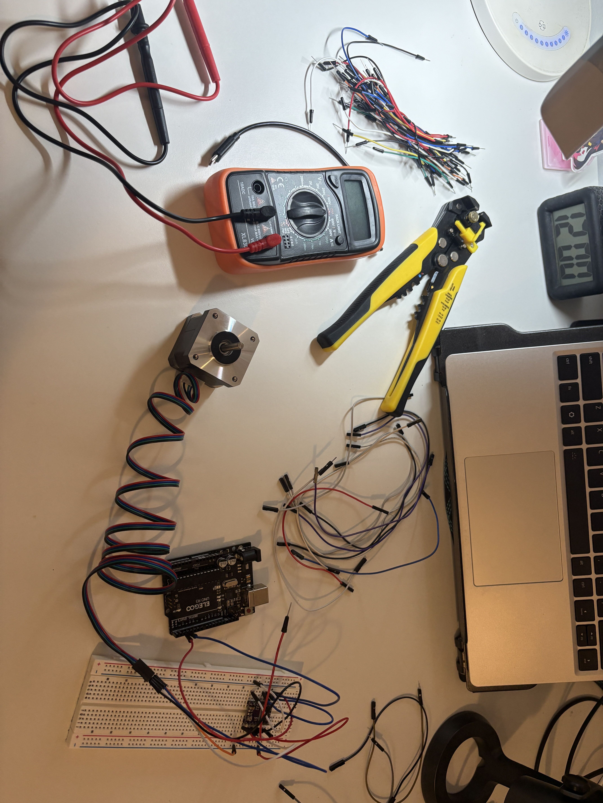

Aug 28 2026 || 1.5 Hours

Mainly research day!

By happanchance, I came into the possesion of a couple of stepperloine stepper motors and I saw a pretty cool [video](https://www.youtube.com/watch?v=5uq4WGxCw6o) where someone used them to create music and wanted to try to replicate that!

Did research for the most part, turns out I have [this](https://www.omc-stepperonline.com/e-series-nema-17-bipolar-42ncm-59-49oz-in-1-5a-42x42x38mm-4-wires-w-1m-cable-connector-17he15-1504s) type of stepper motor
and need a DRV8825 stepper motor driver to operate it. 

Didn't have the specific driver so went on amazon to order it + a multimeter because I've been meaning to get one and stop borrowing my school's for the summer sob

Here da order

Sep 17 2027 || 2 hours

if i could title this it would be I AM NOT STRIPPING A 12V WIRE AT 12AM IN THE MORNING

Nearly been a month but uh finally got the time to look through what I got and to actually try out the motor today!

Did the wire hookup to all three parts (driver, motor and uno r3) but for some reason my brain thought the r3 had a 12V slot. It does not. HAUIGHUAGUAHGUDS

insert me searching up have common house items are 12v

now i either can strip one of my usbc cables or try to find a 12v battery and hook it up that way

either way its way too late for this and i am not risking me getting electrocuted 

anyways heres an image before i go  through the pain of reading out every cable I have with a multimeter

Sep 18 2026 || 1 hour

okay its afterwards and i want to explode
i thought usbc cables could be read with a multimeter
turns out you cant, which is just AWESOME

so instead of stripping random wires, i just deicded to order a 8xAA(1.5V) container on (amazon)[https://www.amazon.com/VWEICYY-Battery-Holder-housing-Leads/dp/B0DZWWJ7Z9/ref=sr_1_3?crid=1HWNA8JW3TEQW&dib=eyJ2IjoiMSJ9.eE_OnuJlMRH4LHSyYTjHmOis8x6S8AZ_HGA89STBfkJtEqvfXq5P0yieVoe6BjpTp6iubeQrgq7VnUzCiM8J0RqUUn2UIY57sprbQo23wEC05VgoEZY6r7tnJKoEUzzThfM4O0fQG9CTw94c6G4_rV5mdzIfg3wiH0mgn3zqIkbNBno7q74E1nz3LmlaLCjK93ro5jgvrP93S-y7LS_30tBA0LgWINVya7sLhswtWi4.WqQ44GH4EVophllZE-ra4v4Qh0G25xJzKFopPhGLRtE&dib_tag=se&keywords=8x+AA+battery+holder&qid=1789618861&sprefix=8x+aa+battery+holder%2Caps%2C319&sr=8-3]
eventually if i want to have the thing with as many stepper motors i want, may have to get a 12v sla battery instead but for now the plastic one should work

ok now im going to sleep 

Sep 26 2026 || 2 hours

i am going to explode and explode

I've gotten the battery pack some time ago, had school and other things to do and couldn't fine the time to do this

but i regret doing it because ive been struggling with the wiring and other parts of the drive board 

trying to get the thing at 0.6v processed to the mottor but its really finicky, and seems like the motor isn't working at all??
its making noise and turns/moves when I leave it alone but I can't seem to make it have a full rotation

Sep 27 2026 || 3 hours

yes i didnt sleep its about 3 am now BUT IT WORKS

after fiddling with wiring, switching a driver controller board because I think I broke the first one....

+ screwing around with exact volatge on the drive controller via screw tights + lots of datasheet reading

= me very very tired BUT THE MOTOR SPINS INSTEAD OF MAKING WEIRD NOISES

0.75V for the screw as a thing i can look back in the future

little unsure because the controller board is getting really hot but for now it works and thats that

now need to figure out what type of code make what sort of pitch